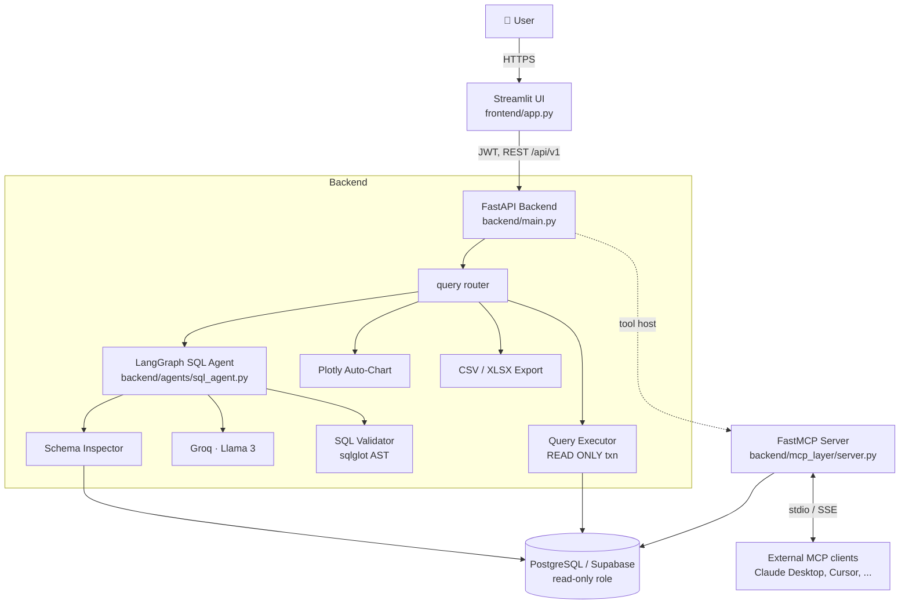
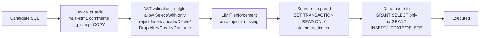

# Architecture

## 1. High-level system



## 2. Per-request data flow

```mermaid
sequenceDiagram
    autonumber
    participant U  as User (Streamlit)
    participant A  as FastAPI /query
    participant AG as LangGraph Agent
    participant S  as Schema Cache
    participant L  as Groq Llama 3
    participant V  as SQL Validator
    participant DB as PostgreSQL (RO)

    U->>A: POST /api/v1/query { question, session_id }
    A->>AG: agent.run()
    AG->>S: load_schema() (cached, TTL 10 min)
    AG->>L: prompt = schema + few-shot + history + question
    L-->>AG: candidate SQL
    AG->>V: validate_sql(sql)
    alt unsafe
        V-->>AG: UnsafeQueryError (with reason)
        AG->>L: regenerate with self-correction (max 1)
        L-->>AG: corrected SQL
        AG->>V: validate_sql(sql)
    end
    V-->>AG: safe SQL (with LIMIT injected)
    AG->>L: build explanation
    L-->>AG: plain English
    AG-->>A: { sql, explanation }
    A->>DB: SET TRANSACTION READ ONLY; SELECT ...
    DB-->>A: rows
    A->>A: build_chart(df)
    A-->>U: { sql, explanation, rows, chart }
```

## 3. Security model (defense in depth)



Every layer is independent. A bypass of any one is caught by the next.

## 4. Why LangGraph (not a chain)

A linear chain works until you need conditional repair:

> generate → validate → if unsafe, regenerate with the parser's feedback.

That's a graph with a conditional edge. LangGraph models it explicitly,
so the retry policy is visible in `_build_graph()` instead of buried in
`if` statements. Retries are bounded (≤ 1) and the validator's reject
reason is fed back into the next generation as context.

## 5. Why a custom FastMCP server

The off-the-shelf `@modelcontextprotocol/server-postgres` exposes raw
read-only queries. We keep our own server because:

- The same validator runs at the MCP tool boundary, so external MCP
  clients (Claude Desktop, Cursor) inherit the same safety contract.
- Schema is exposed as MCP **Resources** for lazy loading, not stuffed
  into every prompt.
- Business definitions ("what is revenue?") live as MCP **Prompts**.

The official server is provided as a fallback in
`backend/mcp_layer/client_examples.py`.

## 6. Caching & scaling notes

| Concern              | Local default              | Production swap                    |
|---------------------|----------------------------|------------------------------------|
| Schema cache         | In-process dict, 10-min TTL | Redis (so all workers share)        |
| Conversation memory  | In-process deque per session| Redis Hash per session              |
| Rate limit           | In-memory token bucket      | `slowapi` + Redis                   |
| LLM call cache       | None                        | Redis keyed on (schema_hash, q)    |
| Workers              | uvicorn `--workers 2`       | Gunicorn + uvicorn worker class    |
| Observability        | JSON logs to stdout         | OpenTelemetry → Datadog/Honeycomb  |
