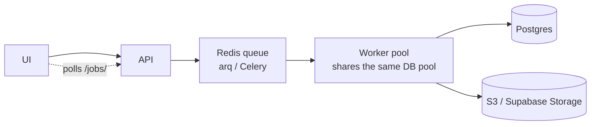

# Scaling to enterprise use

The default deployment is a sensible single-instance setup. This document
covers the changes needed to scale horizontally and operate the system
under enterprise load.

## 1. Caching

Three caches earn their keep:

| Cache              | Key                                | TTL    | Backend |
|-------------------|------------------------------------|--------|---------|
| Schema introspection | `schema:public`                  | 10 min | Redis   |
| LLM SQL generation   | sha256(schema_hash + question)   | 1 h    | Redis   |
| Result memoization   | sha256(safe_sql)                 | 1 min  | Redis   |

The schema and LLM caches give the largest wins — schema introspection
runs four catalog queries (~50ms each on a big DB), and Groq calls cost
real money plus 300-800 ms.

Implementation sketch (add `aiocache[redis]`):

```python
# backend/services/cache.py
from aiocache import Cache
cache = Cache(Cache.REDIS, endpoint="redis", port=6379, namespace="t2s")
```

Wrap `agent.run` and `load_schema` so the cached path is the default and
the network path is the fallback.

## 2. Conversation memory at scale

Replace `agents/memory.py`'s in-process deque with a Redis Hash:

```
HKEY = "mem:<session_id>"
HASH FIELDS: i (counter), 0, 1, 2, ... (turns)
TTL on the key  : 3600
```

This lets multiple uvicorn workers share state and gives free expiry.

## 3. Background and async execution

For queries that are slow (heavy joins, large `GROUP BY`) or for scheduled
reports:



Use **arq** (asyncio-native) or **Celery** (battle-tested) — both work.
The trick is that the worker can reuse `services/query_executor.py`
unchanged.

## 4. Rate limiting

The in-memory middleware in `middleware/__init__.py` is per-process. In
production, swap for `slowapi` backed by Redis so all workers count
against the same bucket. Two tiers:

| Limit                      | Window | Reason                                |
|---------------------------|--------|---------------------------------------|
| 60 queries / user / minute | 60 s   | Generous limit for interactive use.   |
| 5 queries / user / second  | 1 s    | Burst guard against scripted clients. |

## 5. Observability

- **Logs**: JSON to stdout (already implemented). Pipe into Datadog,
  Better Stack, Loki, or CloudWatch.
- **Tracing**: wrap `agent.run` and `execute_sql` with OpenTelemetry
  spans. The `duration_ms` field in logs is already a span-friendly
  attribute.
- **Metrics** (Prometheus `prometheus-fastapi-instrumentator`):
  - `query_total{status="ok|unsafe|error"}` counter
  - `query_duration_ms` histogram (p50/p95/p99)
  - `llm_token_total{kind="prompt|completion"}` counter
  - `db_pool_in_use` gauge

## 6. Audit log

Auditability is a hard requirement for any enterprise BI tool. Persist
every request:

```sql
CREATE TABLE audit.query_log (
    id          BIGSERIAL PRIMARY KEY,
    user_id     TEXT NOT NULL,
    session_id  TEXT NOT NULL,
    question    TEXT NOT NULL,
    generated_sql TEXT NOT NULL,
    row_count   INT,
    duration_ms INT,
    status      TEXT NOT NULL,    -- ok | unsafe | error
    rejection_reason TEXT,
    request_id  UUID,
    created_at  TIMESTAMPTZ DEFAULT NOW()
);
```

Write to this table from a `BackgroundTasks` callback inside
`routers/query.py`. Never block the request on the audit write — but do
alert on audit-write failures.

## 7. Vector memory (advanced)

Once you have hundreds of past queries, embed the (question, SQL) pairs
and store them in pgvector. On a new question, retrieve the top-3
similar past pairs and prepend them as few-shot examples. This is
strictly better than the static few-shot list in `prompts.py` once you
have real usage data.

## 8. Multi-tenancy

Two clean options:

- **Connection per tenant**: each tenant has its own DATABASE_URL.
  Resolve it from the JWT claims and build the engine on demand
  (cached). Strongest isolation.
- **Schema per tenant**: one cluster, one role per tenant, `SET
  search_path` after authentication. Cheaper, fine for SMB SaaS.

Either way, the SQL safety layer is unchanged — it operates on the
parsed AST, not on the connection.

## 9. LLM provider redundancy

Groq is fast and cheap but is a single point of failure. Add a
fallback chain:

```python
llm = ChatGroq(...)
try:
    out = await llm.ainvoke(...)
except (RateLimitError, APIError):
    out = await ChatAnthropic(...).ainvoke(...)
```

Wrap in a small `LLMRouter` class. Same prompts work across providers
when temperature=0.
